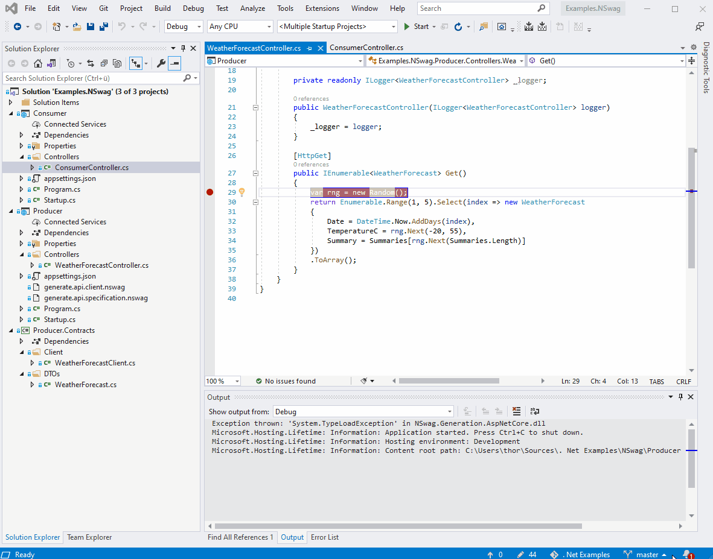
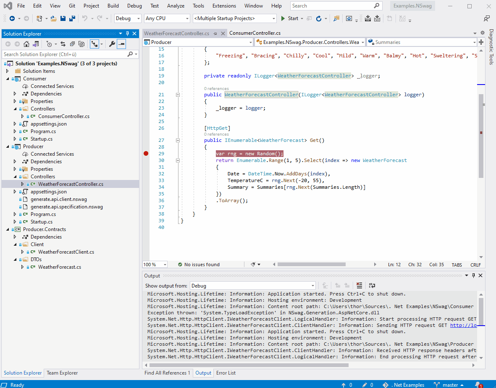
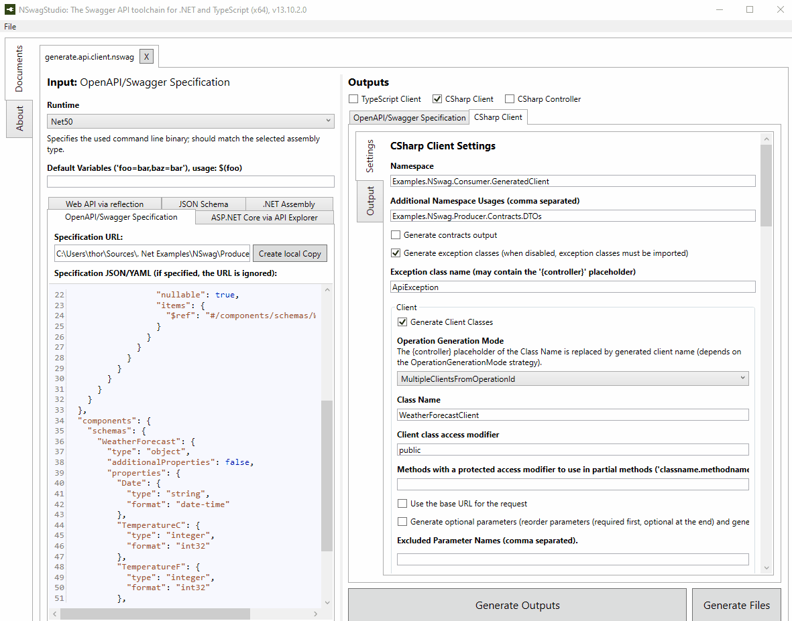

# Asp .Net 5 WebAPI with Swagger and NSwag. Auto-generate an typesafe and versionized HttpClient during build!

NSwag is a popular toolchain for .Net and Typescript clients. Whith this toolchain you can create a typesafe HttpClient. Stop using RestEase or Refit. Use NSwag!

## Requirements
* [Visual Studio 2019](https://visualstudio.microsoft.com/downloads/)
* [.Net 5](https://dotnet.microsoft.com/download)
* [NSwag Studio (not required)](https://github.com/RicoSuter/NSwag/releases)


## Start the example applications

* Right click on the solution and open the properties
* Select multiple startup projects
* Select Producer and Consumer
* Press Ok, go back and run them together




## Changing the API of the REST server application will automatically update the HttpClient used by the Consumer

Any change of the producer API will automatically change the auto-generated WeatherForecastClient which is stored in the Producer.Contracts library. A consumer just has to refrence this library and gets a versionized and typesafe HttpClient.




## How does it work?

In the Producer.csproj file are two after-build steps defined which 1) generates a temporary openapi json specification from an assembly and 2) genrates a HttpClient from the specification. All during build-time! 

```xml
  <Target Name="NSwagScripts" AfterTargets="Build">
    <Exec ConsoleToMSBuild="true" Command="$(NSwagExe_Net50) run generate.api.specification.nswag" />
    <Exec ConsoleToMSBuild="true" Command="$(NSwagExe_Net50) run generate.api.client.nswag" />
  </Target>
```

So how to create those nswag files? 
NSwagUI is a desktop application with a UI with which you can generate those files. In the main menu choose File->Save as... let you store them on the filesystem.
Those files can also be opened with it and then you can make some changes in the configuration.




### Links

* https://github.com/RicoSuter/NSwag/
* https://docs.microsoft.com/en-us/aspnet/core/tutorials/getting-started-with-nswag?view=aspnetcore-5.0

