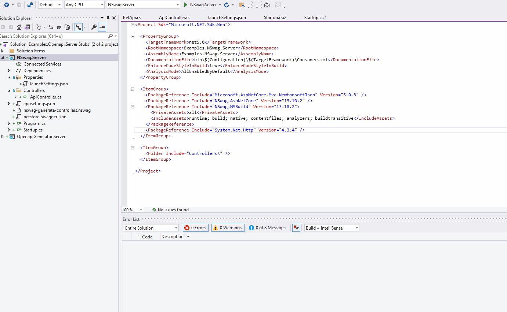
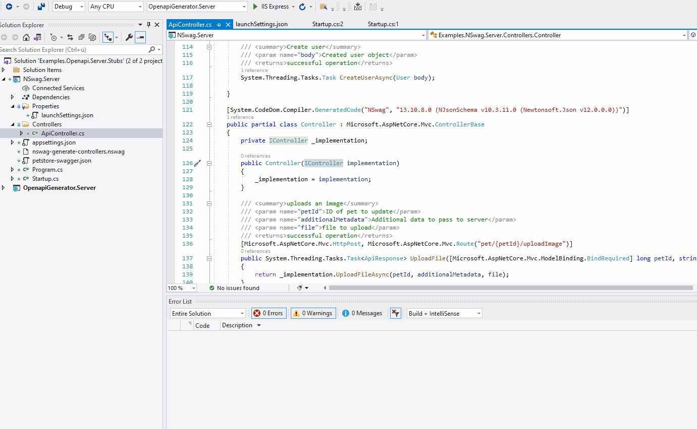

# Create Server Stubs using Swagger and Asp.Net

In this example I will try out 2 popular server stub generator libraries which using swagger as input and create asp .net controllers. 

## Requirements
* [Visual Studio 2019](https://visualstudio.microsoft.com/downloads/)
* [.Net 5](https://dotnet.microsoft.com/download)
* [NSwag Studio](https://github.com/RicoSuter/NSwag/releases)
* [Openapi-generator-cli](https://github.com/OpenAPITools/openapi-generator-cli)


## Create NSwag Server Stub

Open ./NSwag.Server/nswag-generate-controllers.nswag with NSwag Studio and generate Files.

This creates an ApiController in the Controllers folder, including models and an IController interface which must be implemented by you to run this example.

So at the end you must implement the server logic, move some classes into other folders and rename some classes and interfaces.

The benefit of using this library is that all options can be configured through a UI, but the generated outputs helps not much at all.




## Create Openapi Generator Server Stub

Openapi Generator is the successor of Swagger Codegen.

Run OpenapiGenerator.Server/openapi-generators-create-server.cmd.

or 
```
openapi-generator-cli generate -i petstore-swagger.json -g aspnetcore -o ./ --additional-properties=sourceFolder=../,packageName=OpenapiGenerator.Server
```
This script will create a full .net core 3.1 web application with a full working example of HttpGet requests. The post and put requests have to be implemented.
All models are stored in a separate folder.

It looks very useful.



### Links

Config options for aspnetcore: https://openapi-generator.tech/docs/generators/aspnetcore


