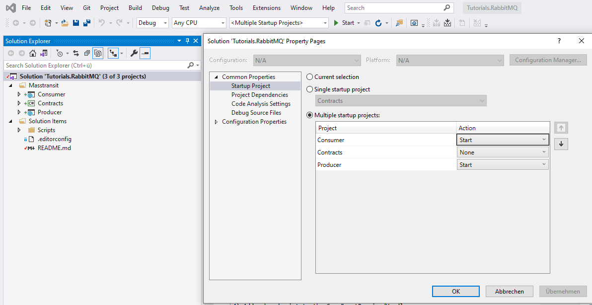
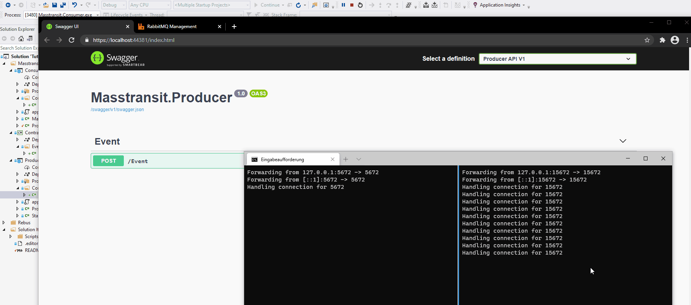

# RabbitMQ with Masstransit, .Net 5 and Kubernetes

RabbitMQ is a great messagbroker which helps in creating microservices which should be loosed coupled. To use RabbitMQ directly is difficult, especially in cases of error handling and dynamically creating queues and so on. 
Masstransit is a popular libraries which I will describe and I will write a simple example application to demonstrate it's behaviour.

## Requirements
* [Visual Studio 2019](https://visualstudio.microsoft.com/downloads/)
* [.Net 5](https://dotnet.microsoft.com/download)
* [Docker](https://www.docker.com/products/docker-desktop)
* [Windows Terminal to script port forwarding](https://github.com/microsoft/terminal)
* [Docker fuer Windows](https://docs.docker.com/docker-for-windows/install/)
* [Helm](https://helm.sh/docs/intro/install/)


## Install and Start RabbitMQ
 
 Execute the following batch script file to download and install RabbitMQ
 ```console
 Tutorials\RabbitMQ\Scripts\1-install-rabbit-mq.bat
 
```

* Access the RabbitMQ UI in the browser with the url localhost:15672

## Masstransit

With 10 million Nuget downloads, Masstransit is the most popular library for integrating RabbitMQ into a .Net Core application, along with the low-level RabbitMQClient. It provides an abstraction to the transport layer. Besides RabbitMQ also Kafka and similar Messagebroker can be used to deliver messages and events.

1) Start Docker
2) Make Kubernetes ports accessible from local host, Tutorials\RabbitMQ\Scripts\2-automate-port-forwarding.cmd
3) Add a breakpoint at the EventController where an event gets published
4) Add a breakpoint to the SomeEventReceivedHandler
5) Start the Masstransit Producer and Consumer with a Debug configuration
6) Also open a new browser to see the RabbitMQ queues and exchanges
7) Post an Event over the SwaggerUI


### Run multiple projects with VisualStudio

* Right click on the solution and open the properties
* Select multiple startup projects
* Select Masstransit Producer and Consumer
* Press Ok, go back and run them together




### Live Demo





### Links

* https://github.com/MassTransit/MassTransit
* https://masstransit-project.com/

